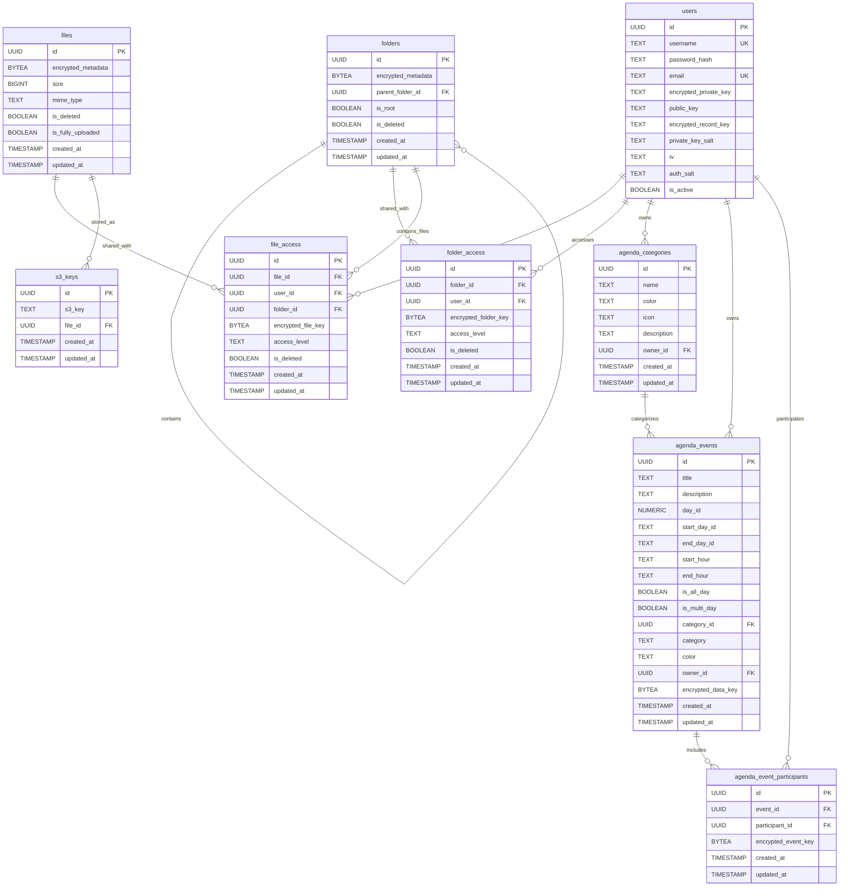

# Database Schema Documentation

## Table des Matières

1. [Vue d'Ensemble](#vue-densemble)
2. [Diagramme ERD](#diagramme-erd)
3. [Tables Détaillées](#tables-détaillées)
4. [Relations entre Tables](#relations-entre-tables)
5. [Index et Contraintes](#index-et-contraintes)
6. [Chiffrement E2EE](#chiffrement-e2ee)
7. [Migrations SQLx](#migrations-sqlx)
8. [Requêtes Courantes](#requêtes-courantes)
9. [Best Practices](#best-practices)

---

## Vue d'Ensemble

Le schéma de base de données PostgreSQL de GAUZIAN est conçu pour supporter un **système de stockage cloud chiffré de bout en bout (E2EE)**. Toutes les données sensibles (noms de fichiers, contenus, métadonnées) sont chiffrées côté client avant d'être envoyées au serveur.

### Modules Fonctionnels

1. **Authentication** - Gestion des utilisateurs et clés cryptographiques
2. **Drive** - Stockage de fichiers/dossiers avec permissions
3. **Agenda** - Calendrier partagé avec événements chiffrés
4. **Access Control** - Permissions granulaires (owner, editor, viewer)

### Statistiques du Schéma

- **Tables** : 9
- **Relations (Foreign Keys)** : 15
- **Index** : 4+ (sur colonnes critiques)
- **Contraintes UNIQUE** : 2 (file_access, folder_access)
- **Type de données** : UUID (primary keys), BYTEA (encrypted data), TEXT, BIGINT, BOOLEAN, TIMESTAMP

---

## Diagramme ERD



---

## Tables Détaillées

### 1. `users` - Utilisateurs et Clés Cryptographiques

Table centrale pour l'authentification et la gestion des clés E2EE.

| Colonne | Type | Contraintes | Description |
|---------|------|-------------|-------------|
| `id` | UUID | PRIMARY KEY | Identifiant unique utilisateur |
| `username` | TEXT | NOT NULL, UNIQUE | Nom d'utilisateur (login) |
| `email` | TEXT | NOT NULL, UNIQUE | Email de l'utilisateur |
| `password_hash` | TEXT | NOT NULL | Hash SHA256 du mot de passe (⚠️ à migrer vers Argon2) |
| `auth_salt` | TEXT | NOT NULL | Salt pour hashing du mot de passe |
| `is_active` | BOOLEAN | NOT NULL, DEFAULT TRUE | Compte actif ou suspendu |
| `encrypted_private_key` | TEXT | NOT NULL | Clé privée RSA-4096 chiffrée avec mot de passe |
| `public_key` | TEXT | NOT NULL | Clé publique RSA-4096 (non chiffrée) |
| `encrypted_record_key` | TEXT | NOT NULL | Clé maître pour chiffrement des enregistrements |
| `private_key_salt` | TEXT | | Salt pour dérivation clé de chiffrement |
| `iv` | TEXT | | Vecteur d'initialisation (IV) pour AES |

**Crypto Pattern** :
1. **Clé privée utilisateur** (`encrypted_private_key`) :
   - Générée côté client (RSA-4096)
   - Chiffrée avec une clé dérivée du mot de passe utilisateur (PBKDF2)
   - Déchiffrée uniquement côté client à la connexion
2. **Clé de record** (`encrypted_record_key`) :
   - Clé symétrique maître pour chiffrer les métadonnées
   - Chiffrée avec la clé publique de l'utilisateur (stockable serveur)
3. **Password hash** :
   - SHA256 avec salt (⚠️ **Security Issue** : à migrer vers Argon2id)

**Exemple de données** :
```sql
INSERT INTO users (id, username, email, password_hash, auth_salt, encrypted_private_key, public_key, encrypted_record_key)
VALUES (
  'a1b2c3d4-...',
  'john_doe',
  'john@example.com',
  'e3b0c44298fc1c149afbf4c8996fb92427ae41e4649b934ca495991b7852b855',  -- Hash SHA256
  '3f8a2b...',  -- Salt
  'U2FsdGVkX1...',  -- Encrypted RSA private key (base64)
  '-----BEGIN PUBLIC KEY-----\nMIIBIjANBgkqhki...',  -- RSA public key (PEM)
  'aBc123XyZ...'  -- Encrypted record key
);
```

---

### 2. `files` - Fichiers Utilisateurs

Métadonnées des fichiers stockés (chunks réels dans MinIO S3).

| Colonne | Type | Contraintes | Description |
|---------|------|-------------|-------------|
| `id` | UUID | PRIMARY KEY | Identifiant unique du fichier |
| `encrypted_metadata` | BYTEA | NOT NULL | Métadonnées chiffrées (nom, extension, tags) |
| `size` | BIGINT | NOT NULL | Taille totale du fichier (en octets) |
| `mime_type` | TEXT | NOT NULL | Type MIME (ex: `image/png`, `application/pdf`) |
| `is_deleted` | BOOLEAN | NOT NULL, DEFAULT FALSE | Soft delete (fichier dans corbeille) |
| `is_fully_uploaded` | BOOLEAN | NOT NULL, DEFAULT FALSE | Upload finalisé (tous les chunks reçus) |
| `created_at` | TIMESTAMP WITH TIME ZONE | DEFAULT CURRENT_TIMESTAMP | Date de création |
| `updated_at` | TIMESTAMP WITH TIME ZONE | DEFAULT CURRENT_TIMESTAMP | Dernière modification |

**Notes** :
- Les **métadonnées chiffrées** (`encrypted_metadata`) incluent : nom du fichier, extension, description, tags
- Le serveur ne connaît **jamais le nom réel** du fichier
- `mime_type` est stocké en clair pour permettre le filtrage serveur (ex: images seulement)
- `is_fully_uploaded = false` : fichier en cours d'upload (chunks incomplets)

**Workflow d'upload** :
1. `initialize_file` → crée enregistrement avec `is_fully_uploaded = false`
2. `upload_chunk` (multiple) → écrit chunks dans MinIO S3
3. `finalize_upload` → met à jour `is_fully_uploaded = true`

---

### 3. `folders` - Dossiers (Hiérarchie)

Structure de dossiers chiffrés avec support de hiérarchie infinie.

| Colonne | Type | Contraintes | Description |
|---------|------|-------------|-------------|
| `id` | UUID | PRIMARY KEY | Identifiant unique du dossier |
| `encrypted_metadata` | BYTEA | NOT NULL | Métadonnées chiffrées (nom, description) |
| `parent_folder_id` | UUID | FK → folders(id) ON DELETE CASCADE | Dossier parent (NULL si root) |
| `is_root` | BOOLEAN | NOT NULL, DEFAULT FALSE | Dossier racine de l'utilisateur |
| `is_deleted` | BOOLEAN | NOT NULL, DEFAULT FALSE | Soft delete (dossier dans corbeille) |
| `created_at` | TIMESTAMP WITH TIME ZONE | DEFAULT CURRENT_TIMESTAMP | Date de création |
| `updated_at` | TIMESTAMP WITH TIME ZONE | DEFAULT CURRENT_TIMESTAMP | Dernière modification |

**Hiérarchie** :
- **Root folder** : `parent_folder_id = NULL`, `is_root = true` (1 par utilisateur)
- **Sous-dossiers** : `parent_folder_id` pointe vers le parent
- **Cascade Delete** : Supprimer un dossier supprime tous ses enfants (récursif)

**Exemple de hiérarchie** :
```
Root (is_root=true)
├── Documents (parent_folder_id = Root.id)
│   ├── Work (parent_folder_id = Documents.id)
│   └── Personal (parent_folder_id = Documents.id)
└── Photos (parent_folder_id = Root.id)
    └── Vacation (parent_folder_id = Photos.id)
```

---

### 4. `file_access` - Permissions Fichiers

Contrôle d'accès granulaire pour partage de fichiers.

| Colonne | Type | Contraintes | Description |
|---------|------|-------------|-------------|
| `id` | UUID | PRIMARY KEY | Identifiant de la permission |
| `file_id` | UUID | FK → files(id) ON DELETE CASCADE, NOT NULL | Fichier partagé |
| `user_id` | UUID | FK → users(id) ON DELETE CASCADE, NOT NULL | Utilisateur ayant accès |
| `folder_id` | UUID | FK → folders(id) ON DELETE SET NULL | Dossier contenant le fichier (optionnel) |
| `encrypted_file_key` | BYTEA | NOT NULL | Clé de déchiffrement du fichier (chiffrée avec clé publique user) |
| `access_level` | TEXT | NOT NULL, DEFAULT 'read' | Niveau d'accès : `owner`, `editor`, `viewer` |
| `is_deleted` | BOOLEAN | NOT NULL, DEFAULT FALSE | Permission révoquée (soft delete) |
| `created_at` | TIMESTAMP WITH TIME ZONE | DEFAULT CURRENT_TIMESTAMP | Date de création |
| `updated_at` | TIMESTAMP WITH TIME ZONE | DEFAULT CURRENT_TIMESTAMP | Dernière modification |
| **UNIQUE** | | (file_id, user_id) | Un utilisateur ne peut avoir qu'une permission par fichier |

**Access Levels** :
- `owner` : Propriétaire du fichier (peut supprimer, partager, modifier permissions)
- `editor` : Peut modifier le fichier et ses métadonnées
- `viewer` : Lecture seule (téléchargement uniquement)

**Partage E2EE** :
1. **Propriétaire** partage fichier avec `user2`
2. Serveur récupère `user2.public_key`
3. Client chiffre `file_key` avec `user2.public_key` → `encrypted_file_key`
4. Serveur stocke l'enregistrement `file_access` (ne peut pas déchiffrer la clé)
5. `user2` récupère `encrypted_file_key`, la déchiffre avec sa clé privée, et peut lire le fichier

---

### 5. `folder_access` - Permissions Dossiers

Permissions pour partage de dossiers (appliquées récursivement aux sous-dossiers).

| Colonne | Type | Contraintes | Description |
|---------|------|-------------|-------------|
| `id` | UUID | PRIMARY KEY | Identifiant de la permission |
| `folder_id` | UUID | FK → folders(id) ON DELETE CASCADE, NOT NULL | Dossier partagé |
| `user_id` | UUID | FK → users(id) ON DELETE CASCADE, NOT NULL | Utilisateur ayant accès |
| `encrypted_folder_key` | BYTEA | NOT NULL | Clé de déchiffrement du dossier (chiffrée avec clé publique user) |
| `access_level` | TEXT | NOT NULL, DEFAULT 'read' | Niveau d'accès : `owner`, `editor`, `viewer` |
| `is_deleted` | BOOLEAN | NOT NULL, DEFAULT FALSE | Permission révoquée (soft delete) |
| `created_at` | TIMESTAMP WITH TIME ZONE | DEFAULT CURRENT_TIMESTAMP | Date de création |
| `updated_at` | TIMESTAMP WITH TIME ZONE | DEFAULT CURRENT_TIMESTAMP | Dernière modification |
| **UNIQUE** | | (folder_id, user_id) | Un utilisateur ne peut avoir qu'une permission par dossier |

**Héritage de permissions** :
- Partager un dossier **ne partage pas automatiquement** ses sous-dossiers/fichiers
- L'application doit gérer l'héritage explicitement (à implémenter)

---

### 6. `s3_keys` - Clés S3 des Chunks

Mapping entre fichiers et leurs chunks stockés dans MinIO S3.

| Colonne | Type | Contraintes | Description |
|---------|------|-------------|-------------|
| `id` | UUID | PRIMARY KEY | Identifiant de la clé S3 |
| `s3_key` | TEXT | NOT NULL | Chemin S3 du chunk (ex: `chunks/a1b2c3d4/chunk_0001`) |
| `file_id` | UUID | FK → files(id) ON DELETE CASCADE | Fichier associé |
| `created_at` | TIMESTAMP WITH TIME ZONE | DEFAULT CURRENT_TIMESTAMP | Date de création |
| `updated_at` | TIMESTAMP WITH TIME ZONE | DEFAULT CURRENT_TIMESTAMP | Dernière modification |

**Usage** :
- Fichiers volumineux sont divisés en chunks de 5MB (ex: 100MB → 20 chunks)
- Chaque chunk stocké dans MinIO avec une clé unique
- Cette table permet de :
  - Lister tous les chunks d'un fichier
  - Supprimer les chunks quand le fichier est supprimé (CASCADE)
  - Tracer l'usage du stockage S3

---

### 7. `agenda_categories` - Catégories d'Événements

Catégories pour organiser les événements de calendrier.

| Colonne | Type | Contraintes | Description |
|---------|------|-------------|-------------|
| `id` | UUID | PRIMARY KEY | Identifiant de la catégorie |
| `name` | TEXT | NOT NULL | Nom de la catégorie (ex: "Travail", "Personnel") |
| `color` | TEXT | | Couleur hexadécimale (ex: "#FF5733") |
| `icon` | TEXT | | Nom d'icône (ex: "briefcase", "home") |
| `description` | TEXT | | Description de la catégorie |
| `owner_id` | UUID | FK → users(id) ON DELETE CASCADE, NOT NULL | Propriétaire de la catégorie |
| `created_at` | TIMESTAMP | NOT NULL, DEFAULT CURRENT_TIMESTAMP | Date de création |
| `updated_at` | TIMESTAMP | NOT NULL, DEFAULT CURRENT_TIMESTAMP | Dernière modification |

**Index** : `idx_agenda_categories_owner_id` (performance pour requêtes par utilisateur)

---

### 8. `agenda_events` - Événements de Calendrier

Événements avec données chiffrées (titre, description, horaires).

| Colonne | Type | Contraintes | Description |
|---------|------|-------------|-------------|
| `id` | UUID | PRIMARY KEY | Identifiant de l'événement |
| `title` | TEXT | NOT NULL | Titre de l'événement (⚠️ chiffré côté client) |
| `description` | TEXT | | Description (⚠️ chiffré côté client) |
| `day_id` | NUMERIC | NOT NULL | ID du jour (format YYYYMMDD, ex: 20260211) |
| `start_day_id` | TEXT | NOT NULL | Jour de début (⚠️ chiffré côté client) |
| `end_day_id` | TEXT | NOT NULL | Jour de fin (⚠️ chiffré côté client) |
| `start_hour` | TEXT | NOT NULL | Heure de début (⚠️ chiffré côté client) |
| `end_hour` | TEXT | NOT NULL | Heure de fin (⚠️ chiffré côté client) |
| `is_all_day` | BOOLEAN | NOT NULL | Événement toute la journée |
| `is_multi_day` | BOOLEAN | NOT NULL | Événement sur plusieurs jours |
| `category_id` | UUID | FK → agenda_categories(id) ON DELETE SET NULL | Catégorie associée (optionnel) |
| `category` | TEXT | | Nom de catégorie (⚠️ chiffré côté client) |
| `color` | TEXT | | Couleur personnalisée (⚠️ chiffré côté client) |
| `owner_id` | UUID | FK → users(id) ON DELETE CASCADE, NOT NULL | Propriétaire de l'événement |
| `encrypted_data_key` | BYTEA | NOT NULL | Clé de chiffrement des données de l'événement |
| `created_at` | TIMESTAMP | NOT NULL, DEFAULT CURRENT_TIMESTAMP | Date de création |
| `updated_at` | TIMESTAMP | NOT NULL, DEFAULT CURRENT_TIMESTAMP | Dernière modification |

**⚠️ Migration Crypto** (2026-02-03) :
- Champs `start_day_id`, `end_day_id`, `start_hour`, `end_hour` convertis de NUMERIC → TEXT
- Désormais **chiffrés côté client** avant envoi au serveur
- `encrypted_data_key` : clé symétrique pour déchiffrer ces champs

**Index** : `idx_agenda_events_owner_id`

---

### 9. `agenda_event_participants` - Participants aux Événements

Partage d'événements avec d'autres utilisateurs (E2EE).

| Colonne | Type | Contraintes | Description |
|---------|------|-------------|-------------|
| `id` | UUID | PRIMARY KEY | Identifiant de la participation |
| `event_id` | UUID | FK → agenda_events(id) ON DELETE CASCADE, NOT NULL | Événement partagé |
| `participant_id` | UUID | FK → users(id) ON DELETE CASCADE, NOT NULL | Utilisateur participant |
| `encrypted_event_key` | BYTEA | NOT NULL | Clé de déchiffrement de l'événement (chiffrée avec clé publique participant) |
| `created_at` | TIMESTAMP | NOT NULL, DEFAULT CURRENT_TIMESTAMP | Date de création |
| `updated_at` | TIMESTAMP | NOT NULL, DEFAULT CURRENT_TIMESTAMP | Dernière modification |

**Index** :
- `idx_agenda_event_participants_event_id` (lister participants d'un événement)
- `idx_agenda_event_participants_participant_id` (lister événements d'un participant)

**Partage E2EE** :
1. Propriétaire crée événement avec `encrypted_data_key`
2. Partage avec `user2` → chiffre `data_key` avec `user2.public_key` → `encrypted_event_key`
3. `user2` récupère `encrypted_event_key`, déchiffre avec sa clé privée, puis déchiffre les données de l'événement

---

## Relations entre Tables

### Graphe de Dépendances

```
users
├── owns → files (via file_access)
├── owns → folders (via folder_access)
├── owns → agenda_categories
├── owns → agenda_events
└── participates → agenda_events (via agenda_event_participants)

files
├── stored_in → s3_keys (1:N)
└── shared_via → file_access (1:N)

folders
├── contains → folders (self-reference, hiérarchie)
├── contains → files (via file_access.folder_id)
└── shared_via → folder_access (1:N)

agenda_categories
└── categorizes → agenda_events (1:N)

agenda_events
└── includes → agenda_event_participants (1:N)
```

### Foreign Keys

| Table | Colonne | Référence | On Delete |
|-------|---------|-----------|-----------|
| `folders` | `parent_folder_id` | `folders(id)` | CASCADE |
| `file_access` | `file_id` | `files(id)` | CASCADE |
| `file_access` | `user_id` | `users(id)` | CASCADE |
| `file_access` | `folder_id` | `folders(id)` | SET NULL |
| `folder_access` | `folder_id` | `folders(id)` | CASCADE |
| `folder_access` | `user_id` | `users(id)` | CASCADE |
| `s3_keys` | `file_id` | `files(id)` | CASCADE |
| `agenda_categories` | `owner_id` | `users(id)` | CASCADE |
| `agenda_events` | `owner_id` | `users(id)` | CASCADE |
| `agenda_events` | `category_id` | `agenda_categories(id)` | SET NULL |
| `agenda_event_participants` | `event_id` | `agenda_events(id)` | CASCADE |
| `agenda_event_participants` | `participant_id` | `users(id)` | CASCADE |

**CASCADE vs SET NULL** :
- **CASCADE** : Supprimer l'enregistrement parent supprime les enfants (ex: supprimer un utilisateur supprime ses fichiers)
- **SET NULL** : Supprimer le parent met la clé étrangère à NULL (ex: supprimer une catégorie ne supprime pas les événements, juste la référence)

---

## Index et Contraintes

### Contraintes UNIQUE

```sql
-- Garantit qu'un utilisateur ne peut avoir qu'une permission par fichier
ALTER TABLE file_access ADD CONSTRAINT file_access_file_user_unique
  UNIQUE (file_id, user_id);

-- Garantit qu'un utilisateur ne peut avoir qu'une permission par dossier
ALTER TABLE folder_access ADD CONSTRAINT folder_access_folder_user_unique
  UNIQUE (folder_id, user_id);

-- Username et email uniques
ALTER TABLE users ADD CONSTRAINT users_username_unique UNIQUE (username);
ALTER TABLE users ADD CONSTRAINT users_email_unique UNIQUE (email);
```

### Index de Performance

```sql
-- Agenda : Recherche événements/catégories par propriétaire
CREATE INDEX idx_agenda_events_owner_id ON agenda_events(owner_id);
CREATE INDEX idx_agenda_categories_owner_id ON agenda_categories(owner_id);

-- Agenda : Recherche participants d'un événement
CREATE INDEX idx_agenda_event_participants_event_id ON agenda_event_participants(event_id);
CREATE INDEX idx_agenda_event_participants_participant_id ON agenda_event_participants(participant_id);

-- (À ajouter si performance insuffisante)
-- CREATE INDEX idx_files_is_deleted ON files(is_deleted) WHERE is_deleted = false;
-- CREATE INDEX idx_file_access_user_id ON file_access(user_id);
-- CREATE INDEX idx_folder_access_user_id ON folder_access(user_id);
```

**Recommandations futures** :
- Index partiel sur `files.is_deleted` pour requêtes "fichiers actifs seulement"
- Index sur `file_access.user_id` et `folder_access.user_id` si latence élevée
- Index composite `(user_id, created_at DESC)` pour tri chronologique

---

## Chiffrement E2EE

### Workflow Général

GAUZIAN utilise un **modèle de chiffrement hybride** :

1. **RSA-4096** : Chiffrement asymétrique pour partage de clés
2. **AES-256-GCM** : Chiffrement symétrique pour données volumineuses
3. **PBKDF2** : Dérivation de clé depuis le mot de passe utilisateur

### Cas d'Usage : Upload d'un Fichier

```
1. Client génère clé symétrique aléatoire (file_key)
2. Client chiffre fichier avec file_key (AES-256-GCM)
3. Client chiffre metadata avec record_key (nom, extension, tags)
4. Client chiffre file_key avec public_key propriétaire
5. Client envoie au serveur :
   - encrypted_metadata
   - encrypted chunks (via S3)
   - encrypted_file_key (stocké dans file_access)
6. Serveur stocke tout sans jamais voir le contenu en clair
```

### Cas d'Usage : Partage d'un Fichier

```
1. Owner partage file_id avec user2_id
2. Serveur récupère user2.public_key
3. Client (owner) :
   - Récupère encrypted_file_key (chiffré avec sa propre clé)
   - Déchiffre file_key avec sa private_key
   - Rechiffre file_key avec user2.public_key → encrypted_file_key_for_user2
4. Client envoie au serveur (file_access insert) :
   - file_id
   - user_id = user2_id
   - encrypted_file_key = encrypted_file_key_for_user2
   - access_level = 'viewer'
5. user2 peut maintenant :
   - Récupérer encrypted_file_key_for_user2
   - Déchiffrer avec sa private_key → obtient file_key
   - Télécharger chunks S3 et déchiffrer avec file_key
```

### Tables Crypto

| Table | Champ Chiffré | Clé de Chiffrement | Stockée dans |
|-------|---------------|-------------------|--------------|
| `users` | `encrypted_private_key` | Dérivée du mot de passe (PBKDF2) | Client seulement |
| `users` | `encrypted_record_key` | Clé publique utilisateur | Client après login |
| `files` | `encrypted_metadata` | `record_key` (via `encrypted_record_key`) | `users.encrypted_record_key` |
| `file_access` | `encrypted_file_key` | Clé publique du destinataire | `users.public_key` |
| `folder_access` | `encrypted_folder_key` | Clé publique du destinataire | `users.public_key` |
| `agenda_events` | `title`, `description`, etc. | `encrypted_data_key` | `agenda_events.encrypted_data_key` |
| `agenda_event_participants` | `encrypted_event_key` | Clé publique du participant | `users.public_key` |

---

## Migrations SQLx

### Commandes SQLx

```bash
# Lancer toutes les migrations
sqlx migrate run --database-url $DATABASE_URL

# Créer une nouvelle migration
sqlx migrate add <nom_migration>

# Revert dernière migration (si réversible)
sqlx migrate revert --database-url $DATABASE_URL

# Vérifier statut migrations
sqlx migrate info --database-url $DATABASE_URL
```

### Ordre des Migrations (Chronologique)

1. `20260105105155_create_users_table.sql` - Création table users
2. `20260105105757_add_nouvelle_colonne_to_users.sql` - Ajout colonnes users
3. `20260105134144_add_is_active.sql` - Ajout is_active
4. `20260106092531_add_crypto.sql` - Ajout private_key_salt, iv
5. `20260106100539_add_salut_auth.sql` - Ajout auth_salt
6. `20260109090149_add_recovery_key.sql` - Ajout encrypted_record_key
7. `20260109100104_file_and_file_access.sql` - ⭐ Création tables files, folders, accesses, s3_keys
8. `20260109104330_add_index_to_chunk.sql` - Index sur chunks
9. `20260109110018_add_is_root_bool.sql` - Ajout is_root sur folders
10. `20260109111113_add_access_level.sql` - Ajout access_level (owner/editor/viewer)
11. `20260116151108_is_delet_and_is_fully_upload.sql` - Soft delete + upload status
12. `20260202174912_agenda_table.sql` - ⭐ Création tables agenda (avec faute "agnenda")
13. `20260202180158_agenda_table_rename.sql` - Renommage agnenda → agenda
14. `20260202195555_normalize_column_names.sql` - Normalisation noms colonnes
15. `20260203072635_encrypt_agenda_fields.sql` - ⭐ Chiffrement champs agenda (E2EE)

### Pratiques Recommandées

1. **Toujours tester en dev** avant d'appliquer en production
2. **Backup de la DB** avant toute migration risquée
3. **Migrations irréversibles** : Documenter comment rollback manuellement
4. **Données existantes** : Utiliser `ALTER TABLE ... ALTER COLUMN ... USING` pour conversion
5. **Index** : Créer APRÈS insertion de données (plus rapide)

---

## Requêtes Courantes

### 1. Lister tous les fichiers d'un utilisateur (non supprimés)

```sql
SELECT
  f.id,
  f.encrypted_metadata,
  f.size,
  f.mime_type,
  f.created_at,
  fa.access_level
FROM files f
JOIN file_access fa ON f.id = fa.file_id
WHERE fa.user_id = $1
  AND fa.is_deleted = false
  AND f.is_deleted = false
  AND f.is_fully_uploaded = true
ORDER BY f.created_at DESC;
```

### 2. Lister tous les dossiers (avec hiérarchie)

```sql
-- Récursif : tous les dossiers d'un utilisateur
WITH RECURSIVE folder_tree AS (
  -- Racine
  SELECT
    f.id,
    f.encrypted_metadata,
    f.parent_folder_id,
    f.is_root,
    0 AS level
  FROM folders f
  JOIN folder_access fa ON f.id = fa.folder_id
  WHERE fa.user_id = $1
    AND f.is_root = true
    AND f.is_deleted = false

  UNION ALL

  -- Enfants récursifs
  SELECT
    f.id,
    f.encrypted_metadata,
    f.parent_folder_id,
    f.is_root,
    ft.level + 1
  FROM folders f
  JOIN folder_tree ft ON f.parent_folder_id = ft.id
  WHERE f.is_deleted = false
)
SELECT * FROM folder_tree ORDER BY level, id;
```

### 3. Partager un fichier avec un utilisateur

```sql
-- 1. Récupérer clé publique du destinataire
SELECT public_key FROM users WHERE id = $2;

-- 2. Insérer permission (encrypted_file_key généré côté client)
INSERT INTO file_access (id, file_id, user_id, encrypted_file_key, access_level)
VALUES (gen_random_uuid(), $1, $2, $3, 'viewer')
ON CONFLICT (file_id, user_id) DO UPDATE
  SET encrypted_file_key = EXCLUDED.encrypted_file_key,
      access_level = EXCLUDED.access_level,
      is_deleted = false,
      updated_at = CURRENT_TIMESTAMP;
```

### 4. Récupérer tous les événements d'un utilisateur (calendrier)

```sql
-- Événements possédés + événements partagés
SELECT
  ae.id,
  ae.title,
  ae.day_id,
  ae.is_all_day,
  aep.encrypted_event_key
FROM agenda_events ae
LEFT JOIN agenda_event_participants aep ON ae.id = aep.event_id AND aep.participant_id = $1
WHERE ae.owner_id = $1  -- Mes événements
   OR aep.participant_id = $1  -- Événements partagés avec moi
ORDER BY ae.day_id DESC, ae.start_hour;
```

### 5. Supprimer un fichier (soft delete)

```sql
-- Soft delete (corbeille)
UPDATE files SET is_deleted = true, updated_at = CURRENT_TIMESTAMP WHERE id = $1;

-- Hard delete (définitif, supprime aussi chunks S3 via CASCADE)
DELETE FROM files WHERE id = $1;
```

### 6. Révoquer accès à un fichier

```sql
-- Soft delete de la permission
UPDATE file_access
SET is_deleted = true, updated_at = CURRENT_TIMESTAMP
WHERE file_id = $1 AND user_id = $2;
```

### 7. Statistiques utilisateur

```sql
-- Nombre de fichiers, taille totale, espace utilisé
SELECT
  COUNT(DISTINCT f.id) AS total_files,
  SUM(f.size) AS total_size_bytes,
  SUM(f.size) / 1024.0 / 1024.0 / 1024.0 AS total_size_gb,
  COUNT(DISTINCT fa2.user_id) - 1 AS files_shared_with_count  -- -1 pour exclure l'owner
FROM files f
JOIN file_access fa ON f.id = fa.file_id
LEFT JOIN file_access fa2 ON f.id = fa2.file_id AND fa2.access_level != 'owner'
WHERE fa.user_id = $1
  AND fa.is_deleted = false
  AND f.is_deleted = false
  AND f.is_fully_uploaded = true;
```

---

## Best Practices

### 1. Sécurité

**⚠️ CRITIQUE : Migrations de sécurité à faire** :

```sql
-- Migrer SHA256 → Argon2id pour password_hash
-- (Nécessite modification côté backend Rust pour hasher avec Argon2)
ALTER TABLE users ADD COLUMN password_hash_argon2 TEXT;
-- Puis migration progressive des utilisateurs à la connexion

-- Supprimer les logs de password_hash (actuellement loggé dans auth.rs:201)
```

**Recommandations** :
- Ne JAMAIS logger `password_hash`, `encrypted_private_key`, ou clés déchiffrées
- Utiliser `COOKIE_SECURE=true` en production (HTTPS uniquement)
- Rotation régulière de `JWT_SECRET` (avec période de grâce pour tokens existants)
- Audit régulier de `file_access` / `folder_access` pour détecter permissions anormales

### 2. Performance

**Index à créer si latence > 100ms** :
```sql
-- Fichiers actifs seulement (index partiel)
CREATE INDEX idx_files_active ON files(id) WHERE is_deleted = false AND is_fully_uploaded = true;

-- Accès utilisateur
CREATE INDEX idx_file_access_user_active ON file_access(user_id) WHERE is_deleted = false;
CREATE INDEX idx_folder_access_user_active ON folder_access(user_id) WHERE is_deleted = false;

-- Tri chronologique
CREATE INDEX idx_files_created_desc ON files(created_at DESC);
CREATE INDEX idx_agenda_events_day_id ON agenda_events(day_id DESC);
```

**Connection Pooling** :
- Configuration recommandée (SQLx) :
  - `max_connections: 20` (ajuster selon RAM disponible)
  - `min_connections: 5`
  - `acquire_timeout: 30s`
  - `idle_timeout: 10min`

### 3. Gestion des Données

**Soft Delete vs Hard Delete** :
- **Soft delete** (recommandé) : Permet restauration, audit, RGPD compliance
- **Hard delete** : Seulement si demande explicite utilisateur ou purge automatique (ex: 30j après soft delete)

**Cron Job de nettoyage** :
```sql
-- Supprimer définitivement fichiers supprimés > 30 jours
DELETE FROM files
WHERE is_deleted = true
  AND updated_at < NOW() - INTERVAL '30 days';
```

### 4. Backup & Recovery

**Backup quotidien** (PostgreSQL) :
```bash
# Backup complet
pg_dump -h localhost -U gauzian_user -d gauzian_db -F c -f backup-$(date +%Y%m%d).dump

# Restore
pg_restore -h localhost -U gauzian_user -d gauzian_db -c backup-20260211.dump
```

**Backup incrémental** (WAL archiving) :
```bash
# postgresql.conf
wal_level = replica
archive_mode = on
archive_command = 'cp %p /backup/wal/%f'
```

### 5. Monitoring

**Requêtes lentes** :
```sql
-- Activer pg_stat_statements
CREATE EXTENSION IF NOT EXISTS pg_stat_statements;

-- Top 10 requêtes les plus lentes
SELECT
  query,
  calls,
  mean_exec_time,
  max_exec_time
FROM pg_stat_statements
ORDER BY mean_exec_time DESC
LIMIT 10;
```

**Taille des tables** :
```sql
SELECT
  tablename,
  pg_size_pretty(pg_total_relation_size(schemaname||'.'||tablename)) AS size
FROM pg_tables
WHERE schemaname = 'public'
ORDER BY pg_total_relation_size(schemaname||'.'||tablename) DESC;
```

---

## Annexes

### Schéma SQL Complet (Dump)

Pour générer le schéma complet à partir des migrations :

```bash
cd /home/gael/Bureau/gauzian/gauzian_back
sqlx migrate run --database-url $DATABASE_URL
pg_dump -h localhost -U gauzian_user -d gauzian_db --schema-only > schema.sql
```

### Diagramme ERD Alternatif (ASCII)

```
┌──────────────────┐       ┌──────────────────┐       ┌──────────────────┐
│      users       │       │      files       │       │     folders      │
├──────────────────┤       ├──────────────────┤       ├──────────────────┤
│ id (PK)          │       │ id (PK)          │       │ id (PK)          │
│ username (UK)    │       │ encrypted_meta   │       │ encrypted_meta   │
│ email (UK)       │       │ size             │       │ parent_id (FK)   │
│ password_hash    │       │ mime_type        │       │ is_root          │
│ encrypted_priv_k │       │ is_deleted       │       │ is_deleted       │
│ public_key       │       │ is_fully_upload  │       └──────────────────┘
│ encrypted_rec_k  │       └──────────────────┘              │
└──────────────────┘                 │                        │
        │                            │                        │
        │                            │                        │
        ├───────────────┬────────────┴────────┬───────────────┤
        │               │                     │               │
        ▼               ▼                     ▼               ▼
┌────────────────┐ ┌────────────────┐ ┌────────────────┐ ┌────────────────┐
│  file_access   │ │ folder_access  │ │    s3_keys     │ │agenda_categories│
├────────────────┤ ├────────────────┤ ├────────────────┤ ├────────────────┤
│ id (PK)        │ │ id (PK)        │ │ id (PK)        │ │ id (PK)        │
│ file_id (FK)   │ │ folder_id (FK) │ │ s3_key         │ │ name           │
│ user_id (FK)   │ │ user_id (FK)   │ │ file_id (FK)   │ │ owner_id (FK)  │
│ encrypted_key  │ │ encrypted_key  │ └────────────────┘ └────────────────┘
│ access_level   │ │ access_level   │
└────────────────┘ └────────────────┘
```

### Ressources Externes

- **PostgreSQL Docs** : https://www.postgresql.org/docs/
- **SQLx Migrations** : https://github.com/launchbadge/sqlx/blob/main/sqlx-cli/README.md
- **E2EE Best Practices** : https://blog.cryptographyengineering.com/
- **OWASP Database Security** : https://cheatsheetseries.owasp.org/cheatsheets/Database_Security_Cheat_Sheet.html

---

**Auteur** : GAUZIAN Development Team
**Dernière mise à jour** : 2026-02-11
**Version du schéma** : Migration 20260203072635
